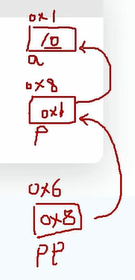
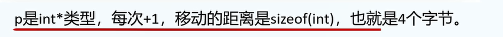
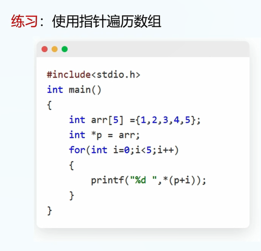
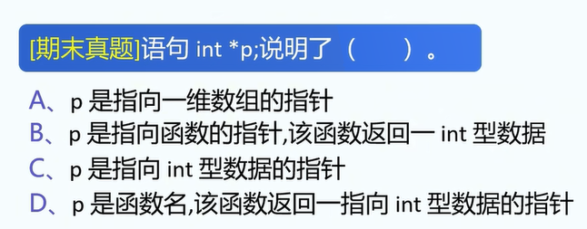

1.C语言中指针比较难,出现的频率很高.

2.指针是一种变量,用来存放某个变量在内存中的地址.

3.指针的声明与初始化:

```
int x = 1;
int * p ; 
p=&x; // p保存了x的地址
// 结合声明与初始化:
int *p = &x;
```

练习1: 声明变量y=2,并令指针p成为变量y的地址.

5.指针: 可以用于获取变量的地址.


6.申请变量时注意的事儿: 只有变量类型会被逗号继承.

```
int *a,b; // 注意: b是int类型变量!
```

6.初始化指针重申:

```
int a = 1;
int *p = &a;
printf("%x",p); // 以16进制输出p
printf("%d",*p); // 反函数
```


7.一级指针和二级指针

二级指针: 存储一级指针的地址.

实例:

```
int a = 10;
int *p = &a;
int **pp = &p;
```

图片:



8.数组和指针

事实上,数组名就是一种特殊的指针,但是依然有一定的区别,这个本节末尾讲.

9.数组在内存中存放是连续的.

代码示例:

```
int a[3]={1,2,3};
printf("a[0]=%x\n", &(a[0]));
printf("a[1]=%x\n", &(a[1]));
printf("a[2]=%x\n", &(a[2]));
```

再来Print一个:

```
printf("a=%x",a);
```

10.实例2:

```
int arr[5]={1,2,3,4,5};
int *p = arr; // arr就是一个指针,这里是让指针等于指针
printf("%d\n",*arr);
printf("%d\n",*p);
```

11.事实上,数组名是指向数组第一个元素的指针常量.

常量: 数组名的值不能被更改.

12.数组的索引,事实上就是一种指针的读取.

```
int arr[5]={1,2,3,4,5};
int *p = arr;
printf("数组第二个元素是%d\n",arr[1]); // 是2
printf("数组第二个元素也是%d\n",*(arr+1)); // 也是2
```

也就是说:

```
arr[n] == *(arr+n)
```

13.




注1: sizeof()函数: C语言自带函数,用于识别变量大小.

14.练习: 申请一个数组={1,2,3,4,5},并使用指针+循环遍历数组并输出.



15.练习2.



答案: C

16.


答案: C

17.


答案: 20,31

注意运算符结合的顺序.


19.数组名与指针的区别:

```
int one=1,two=2;
int * a = &one;
a=&two;	// 可以更改指针类型变量的值
int a[1] = {1};
int b[2] = {1,2};
a=b;	// 不可以将b的值赋给a,因为a的值是一个常量.
```

数组名: 是一个常量,不能改变数组名.


