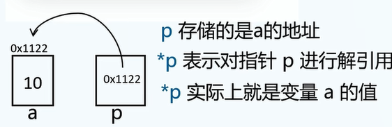
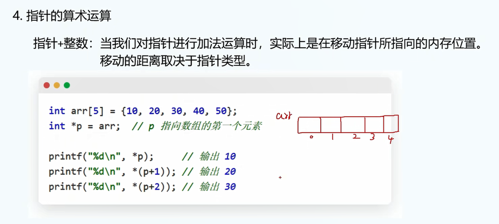
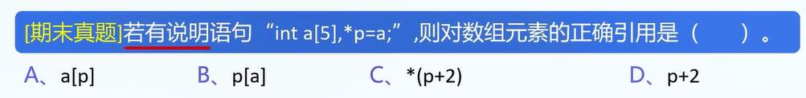
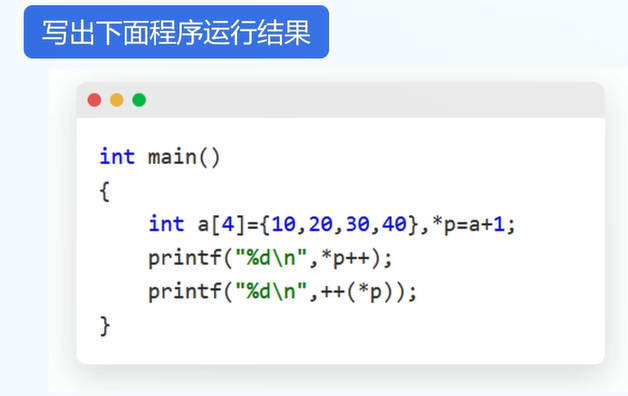

# 指针

1.指针比较难,出现的频率很高.

2.指针是变量,用来存放内存地址.

3.指针的声明:

```
int *p;
```

4.深入研究变量:

A.变量存储在哪里?

B.计算机硬件基础: 硬盘、内存条、操作系统.

C.变量存储在: 内存空间.

D.存储在内存空间的变量,自然会有其地址.(就像每户人家的地址一样.)

5.指针: 可以用于获取变量的地址.

6.初始化指针:

```
int a = 1;
int *p = &a;
printf("%x",p); // 以16进制输出p
printf("%d",*p);
```



7.一级指针和二级指针

二级指针: 存储一级指针的地址.

实例:

```
int a = 10;
int *p = &a;
int **pp = &p;
```

图片:


8.数组和指针

事实上,数组名就是一种特殊的指针.

9.数组在内存中存放是连续的: 原因: 指针.

查看内存的存放地址

10.实例:

```
int arr[5]={1,2,3,4,5};
int *p = arr; // arr就是一个指针,这里是让指针等于指针
printf("%d\n",*arr);
printf("%d\n",*p);
```

11.事实上,数组是指向数组第一个元素的指针常量.

12.数组的索引,事实上就是一种指针.

```
int arr[5]={1,2,3,4,5};
int *p = arr;
printf("数组第二个元素是%d\n",arr[1]); // 是2
printf("数组第二个元素也是%d\n",*(arr+1)); // 也是2
```

也就是说:

```
arr[n] == *(arr+n)
```

13.




sizeof()函数: C语言自带函数.

14.


15.答案: C


16.



17.



答案: 2,4