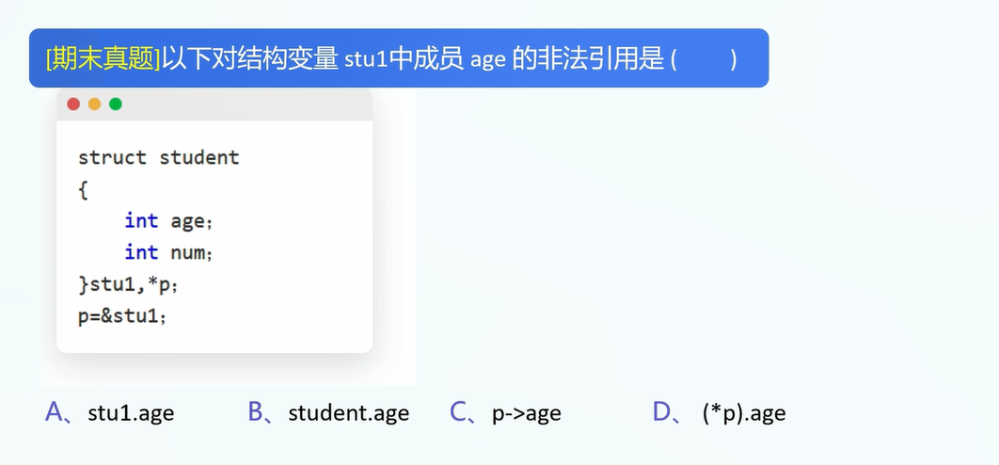
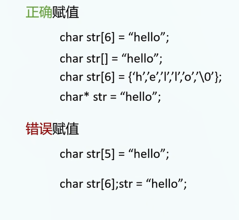
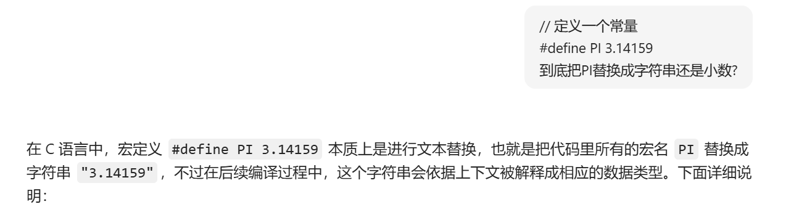
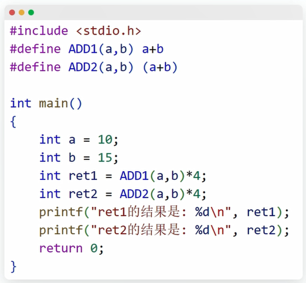

1.数据结构学习套路:

对于任意的数据结构,我们需要学会它的:

A.声明

B.初始化

C.修改

D.读取

声明+初始化+修改+读取


1.结构体

声明实例:

```
struct Person{
	char name[10];
	int age;
	float height;
};
```

声明语法:

```
struct [structName]{
	// 声明变量语句
	声明变量1;
	声明变量2;
	...
};
```

注1: 需要在}后面加上一个分号.

原因如下: 

事实上,我们可以在直接声明结构体结构的同时,创建一个结构体类型的变量:

```
struct Person{
	char name[10];
	int age;
	float height;
}a;
```

所以右大括号不代表语句结束,需要加上分号.

注3: 参考链接: https://www.cnblogs.com/wanmeishenghuo/p/8471662.html

注4: name,age,height被称为结构体成员名.


2.结构体初始化

```
struct Person person1 = {"张三",10,1.67};
```

3.修改结构体成员

A.变量名+.

```
person1.name="李四";
```

B.指针+(&rarr;)

```
struct Person * personP = &person1;
personP->name = "李四";
```


4.访问(读取)结构体成员

A.变量名+.

```
person1.name="李四";
```

B.指针+(->)

```
struct Person * personP = &person1;
personP->name;
```


5.




6.字符串赋值

A.什么是字符串?

答案: 一串字符.


B.C语言中字符串本质是通过什么实现的?

答案: 字符指针/字符数组.

下面先介绍字符数组和字符指针的不同处理方式.

以下先用字符指针的方式初始化字符串.


C.使用字符指针研究字符串.

创初读修:

```
char * str; // 创
str = "123"; // 初
// 合并创+初:
char * str="123";

// 读:
printf("%s",str);

// 修:
str = "456";
```


D.进一步: 使用字符数组研究字符串

```
char str[6];// 创
// 初:
char str[6]="Hello";
char str[6]={'H','e','l','l','o','\0'};// 将字符塞入字符数组中

// 对于字符数组: 创建和初始化必须要一起做
// 不能够:
char str[6]; str="Hello";// 原因: 不能改变数组类型变量的值.

// 读:
str[i]

// 修:
str[i]
```

E.为什么结尾要有一个'\0'?

原因: C语言程序非常傻,如果没有 `'\0'` 作为结束标志，当程序对这个数组进行字符串操作时，它并不知道应该在哪个位置停止，可能会继续读取数组后面的内存单元，从而导致不可预测的结果。

F.字符数组没有讲全,但是目前这些知识够用.(还有一些关于字符数组操作的函数,但是属于望文生义级别)

示例函数:

strlen

strcpy

strcmp

问题多多:

```
    char * str = "Hello";
    char * str2 = "Hello\0 123";
    if(strcmp(str,str2)==0){
        printf("Equal\n");
    }else{
        printf("Not Equal\n");
    }
    注意: \0
```


字符数组题目:

讲出如下原因.




7.预处理

```
#define A B
# 在以后的代码中,用A代替B.
```

要注意的点:





答案: 70,100


8.类型定义: typedef

说明: 为已有的数据类型创建一个新的别名。

语法:

```
typedef [原数据类型] [新数据类型];
```

实例:

```
typedef int Integer; // 将int重命名为Integer
int main(void){
	Integer x=1; // int x = 1;
	printf("x=%d",x);
}
```


