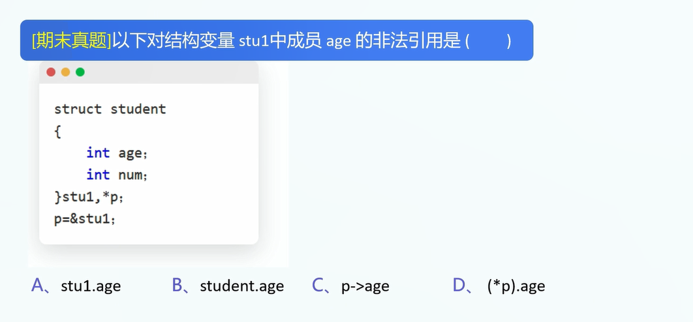
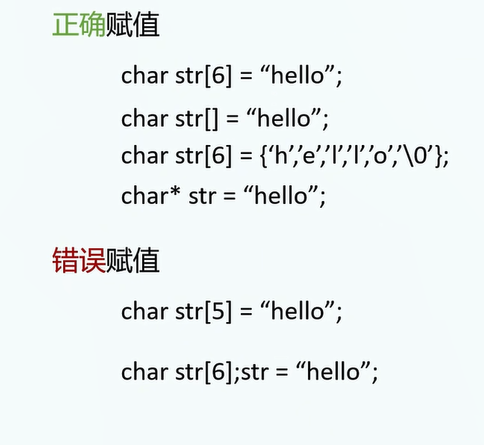

对于任意的数据结构,我们需要学会它的:

A.声明

B.初始化

C.修改

D.读取


1.结构体

声明:

```
struct Person{
	char name[10];
	int age;
	float height;
};
```

注1: 需要在}后面加上一个分号

注2: 可能的原因: 可以写成这样的代码:

```
struct Person{
	char name[10];
	int age;
	float height;
}a;
```

所以右大括号不代表语句结束,需要加上分号.

注3: 参考链接: https://www.cnblogs.com/wanmeishenghuo/p/8471662.html

2.结构体初始化

```
struct Person person1 = {"张三",10,1.67};
```

3.修改结构体成员

A.变量名+.

```
person1.name="李四";
```

B.指针+(->)

```
struct Person * personP = &person1;
personP->name = "李四";
```


4.访问结构体成员

A.变量名+.

```
person1.name="李四";
```

B.指针+(->)

```
struct Person * personP = &person1;
personP->name;
```


5.




6.字符串赋值



7.预处理


答案: 70,100