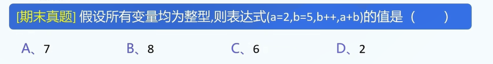
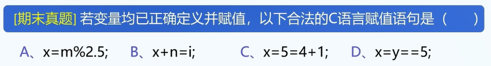
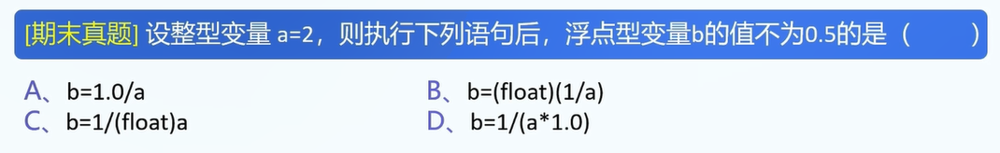
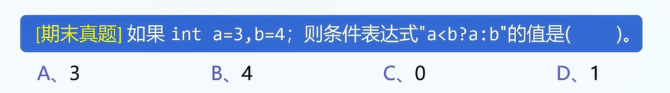
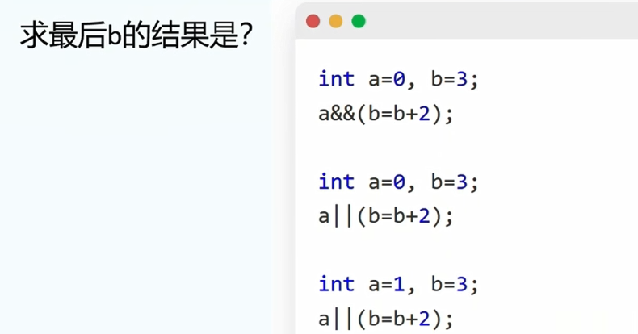
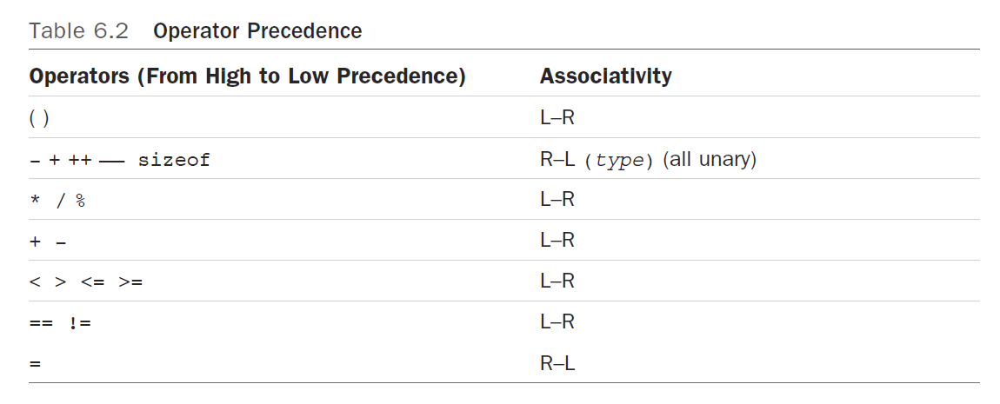
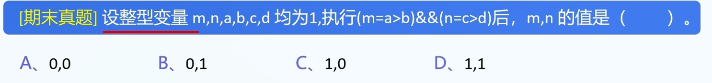
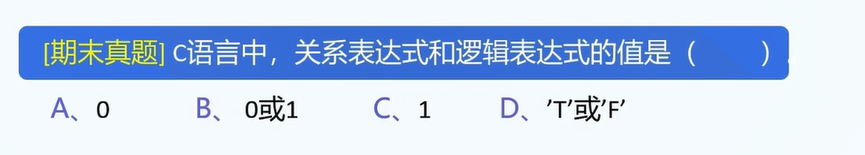
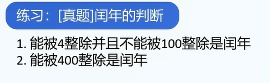

1.C语言常用运算符:	

```
= + - * / % ++ -- == ,
```

注1: 每种运算符在参与运算后都会有一个返回值,例如:

```
1+2; // 返回3
3;
// 1+2等价于3
2*4; // 返回8
// 2*4等价于8
8;
```


2.=运算符

作用: 赋值

```
a=1; // 令a=1
a=a+1;
1=2;
=3;
// 注意: 等号左边的值需要是一个变量.
```

等号的返回值: 右值.

3.+、-、*运算符

```
b=1;
c=2;
a=b+c; // a=3
a=b-c; 
a=b*c;
```


4./运算符: 双目运算符

```
1.整数除整数; // 求整数商
3/2: 1
2.运算数(操作数)中存在浮点数 // 求实数解
3.0/2: 1.5
```


5.%运算符: 求余数.

C语言只支持整数%整数

```
7%4=3
```

目前只教正整数%正整数,关于负整数的之后再说.


6.++、--运算符效果

```
int a=3;

int b = a++; // 先返回a,a再++;
// b=3,a=4;

int b = ++a; // 返回a+1
// b=4,a=4;

int b = a--;
// b=3,a=2;
int b = --a;
// b=2,a=2

3++ // 不行
```


7.逗号,的作用之一: 分割语句,顺次执行,返回最后一个表达式的结果.

```
int sum=5;
int pad=5;
pad = ++sum, pad++, ++pad; 
printf("sum=%d\n",sum);
printf("pad=%d\n",pad);
```

A.从左向右依次执行

B.整个表达式的结果是最后一个表达式的结果

答案:

```
// pad = ++ sum; pad++; ++pad;

// 在执行完第一句话之后的效果:
// pad=6,sum=6

// 三句话都执行完之后的效果:
// pad=8,sum=6
```




答案: B


8.+=,-=,*=,/=,%=各自作用

```
a+=3;  a=a+3;

a/=2; a=a/2;

a%=2;
```


9.==运算符

```

```


10.真题



11.变题

```
    int x = 10;
    int y;
    x=y=4+1; // 可不可以?
    printf("x=%d\n",x);
    printf("y=%d\n",y);
```


11.强制类型转换

A.括号: 负责括住类型

```
int x = (int) 2.3h; // ok
int x = int (2.3); // not ok
```

B.(int): 直接舍去小数部分而非四舍五入

```
int x = (int) 2.5; // x=2;
```


12.真题



答案: B

13.关系运算符

```
<=,>=,<,>,!=,==
```

A.返回结果: 1or0,是一个数.(int变量)


14.三目运算符

```
int x=3;
int y=2;
int z = x>y?x:y;
// int z = 3>2?3:2;
// int z = 3<2?3:2;
// 语法:
[条件判断]?[值1]:[值2];
// 对前错后: 如果是对的就返回前面那个,错的返回后面那个
```


15.真题



16.逻辑运算符(推荐先讲控制语句-分支,再讲逻辑运算符&rarr;符合人类的认知理解)

逻辑非!,逻辑与&&,逻辑或||

!: !x,!y

0.1: 真

-0.1: 逻辑真

&&: 只要有一个表达式为假,则右侧不会再进行计算

||: 只要有一个表达式为真,则右侧不会再进行计算

16.真题



```
各自三问的解:
b=3;
b=5;
b=3;
```

17.运算符优先级: 从高到低

```
1+2*3;
```


优先级高的将优先执行.



Associativity:

运算符执行顺序:

1.左结合: 从左向右执行

大部分运算符都是从左向右执行的.

2.右结合: 从右向左执行.

18.




19.




20.



21.对于这句话,判断它的作用:

```
if(2<x<3){
	printf("x is between 2 and 3");
}
```

22.重整: C语言逻辑类型变量与数值型变量的转化关系.


23.逻辑类型变量处理与数值类型变量处理(非常麻烦)


