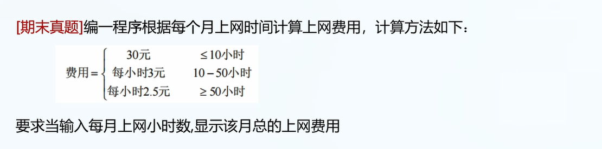

1.三种结构化程序: 顺序，选择，循环。

2.if语句的基本形式:

```
if(x>0){
	int y=1;
	printf("x是一个正数");
}
```

附: 如果if内只嵌套一个语句,可以不写花括号.

```
if(x>0)
	printf("x是正数");

// 如果两个语句:
if(x>0)
	printf("x是正数");
	x--; // x--会被默认执行
```


3.if+else:

```
if(x>0){
	printf("x是一个正数");
}
else{
	printf("x不是正数");
}
```

4.if+else if:

```
if(x>0){
	printf("x是一个正数");
}
else if(x==0){
	printf("x=0");
}
```

5.分号与语句结尾


答案: B

注意语句结尾的分号.

6.


min=-34.

7.



答案:

```
#include <stdio.h>
int main(void){
	unsigned hour = 0;
	scanf("%d",&hour);
	float payment = 0;
	if(hour<=10){
		payment = 30;
	}
	else if(hour<=50){
		payment = hour * 3;
	}
	else{
		payment = hour * 2.5;
	}
	printf("总的上网费用为%f",payment);
}
```

8.switch分支结构:

基本形式:

```
switch(判断变量){
	case 常量1:
		...
		break;
	case 常量2:
		...
		break;
	...
	default:
		...
		break;
	
}
```

9.switch语句注意点


10.


11.

