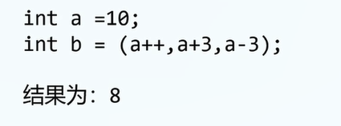
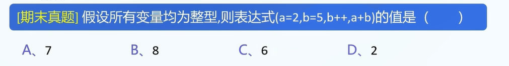
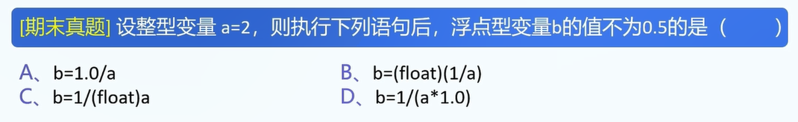
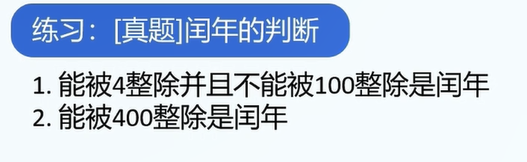

1.运算符:

```
= + - * / % ++ -- ==
```

2.=运算符

作用: 赋值

```
a=1; // 令a=1
```

3.+、-、*运算符

```
b=1;
c=2;
a=b+c;
a=b-c;
a=b*c;
```


4./运算符

```
1.整数除整数; // 求商
2.运算数中存在浮点数 // 求真商
```


5.%运算符

只支持整数%整数


6.++、--运算符效果

```
a++;
++a;
--a;
a--;
```


7.逗号的作用之一: 分割语句

```
int sum=5;
int pad=5;
pad=++sum,pad++,++pad;
// pad=6,sum=6
// pad=8,sum=6
```

A.从左向右依次执行

B.整个表达式的结果是最后一个表达式的结果

题目: 





答案: B

8.+=,-=,*=,/=,%=各自作用


9.==运算符


10.真题


11.强制类型转换

A.括号: 负责括住类型

```
int x = (int) 2.3; // ok
int x = int (2.3); // not ok
```

B.(int): 直接舍去小数部分而非四舍五入

```
int x = (int) 2.5; // x=2;
```


12.真题




13.关系运算符

```
<=,>=,<,>,!=,==
```

A.返回结果: 1or0,是一个数.(int变量)

14.三目运算符

```
x>y?x:y;
```

15.真题


16.逻辑非!,逻辑与&&,逻辑或||

&&: 只要有一个表达式为假,则右侧不会再进行计算

||: 只要有一个表达式为真,则右侧不会再进行计算

16.真题


```
各自三问的解:
b=3;
b=5;
b=3;
```

17.


18.运算符优先级


19.


20.



21.