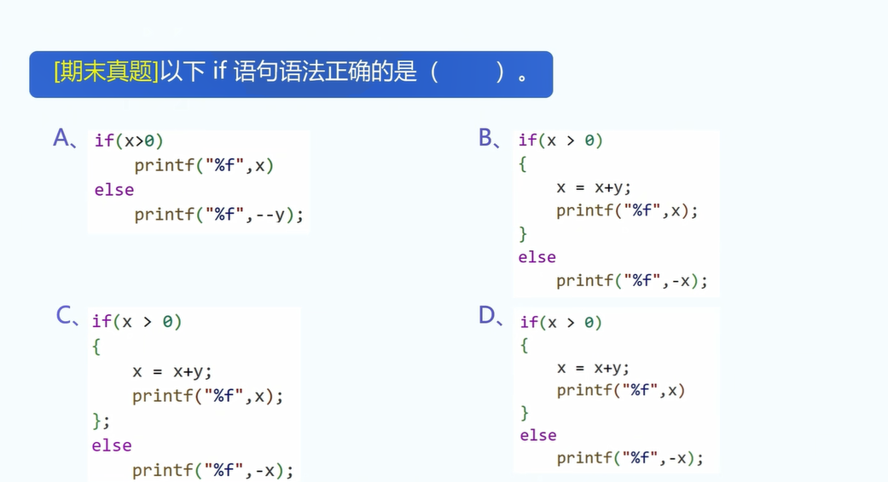
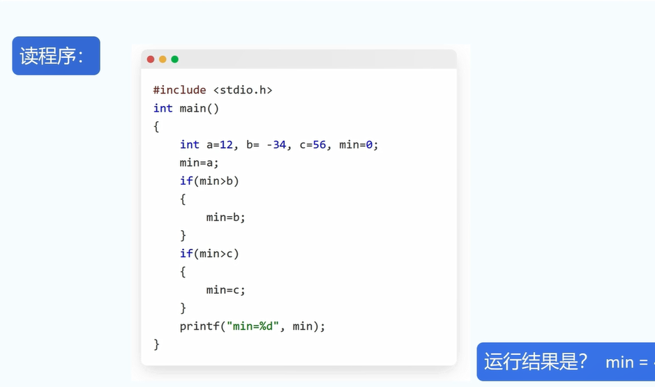
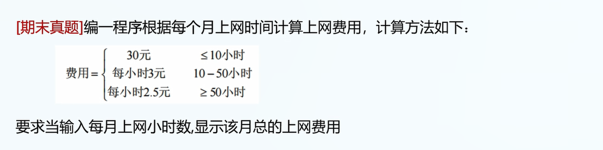
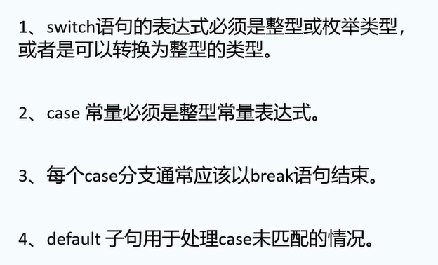
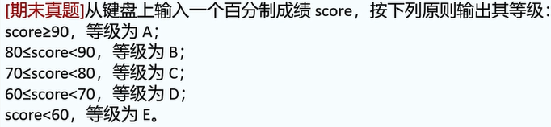
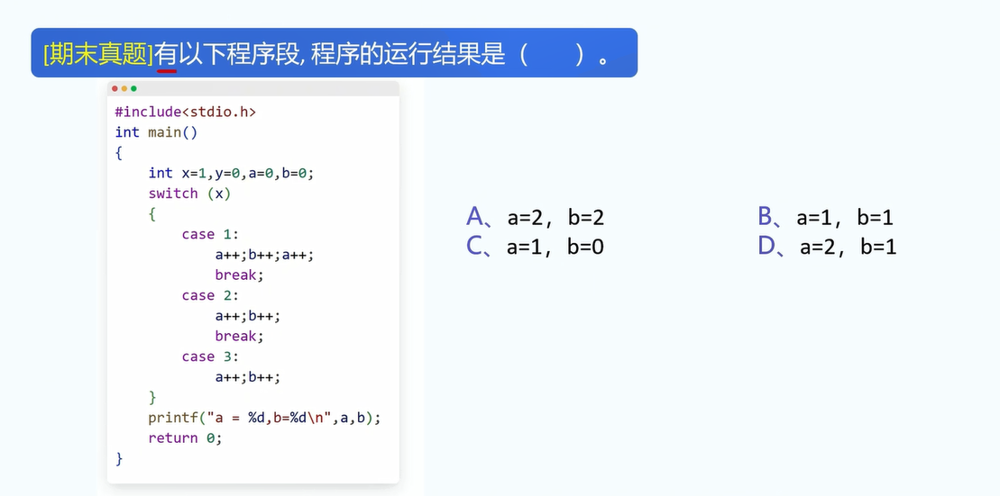

1.编写一个程序,实现符号函数(sgn):

当用户输入正数时输出1,否则什么也不输出.

实例代码段:

```
int x;
scanf("%d",&x);
if(x>0){
	printf("1");
} // 注意: }后面不用加分号
```


2.三种程序结构的组织方式: 顺序，选择，循环。

顺序结构: 程序依次读取代码并一行一行执行.

选择结构: 有些代码可能不执行.(if,else,switch,case)

循环结构: 有些代码可能执行很多次.(while,do-while,for)


3.if语句的基本形式:

```
if(条件判断){
	执行语句;
}

// 也可以这样写:
if(条件判断)
{
	执行语句;
}
```

实例:

```
if(x>0){
	printf("x不是一个负数\n");
	printf("x是一个正数");
}
```

注1: 如果if内只嵌套一个语句,可以不写花括号.

```
// 正确的
if(x>0)
	printf("x是正数");

// 如果是两个语句:
if(x>0)
	printf("x是正数");
	x--; // 无论x是否大于0,x--都会被默认执行,很可能并非写程序者的本意.
```

3.else: 如果if语句内的内容不成立,则默认执行else中的代码.

if+else:

```
if(x>0){
	printf("x是一个正数");
}
else{
	printf("x不是正数");
}
```


4.if+else if:

```
if(x>0){
	printf("x是一个正数");
}
// 注意: 判断相等是两个等号而非一个等号
else if(x==0){
	printf("x=0");
}
else if(x>-1){
	printf("-1<x<0");
}
```


5.题目1.判断语法正确与否.

注意: 语句结尾的分号(何时该加,何时不该加).

提示: if+{}后面不加分号,正常语句后面默认加分号.



答案: B


6.题目2.



答案: min=-34.

7.题目2.



提示: 使用if+else if完成此题目.

记得写完代码自行测试一下.

答案:

```
#include <stdio.h>
int main(void){
	unsigned hour = 0;
	scanf("%d",&hour);
	float payment = 0;
	if(hour<=10){
		payment = 30;
	}
	else if(hour<=50){
		payment = hour * 3;
		// 刚开始的写法:
		// payment = (hour-10)*3+30;
	}
	else{
		payment = 150+(hour-50) * 2.5;
	}
	printf("总的上网费用为%f",payment);
}
```


8.使用switch的意义: 

表面上: 当if-else太多时,使用switch-case可以简化逻辑判断.

实际上: 考试要考.如果不考,建议全部用if-else.

switch分支结构语法:

```
switch(待判断变量){
	case 常量1:
		...
		break;
	case 常量2:
		...
		break;
	...
	default:
		...
		break;
	
}
```

10.switch语句实例:

```
int x = 1;
int y=1;
switch(x){
	case y:
		printf("x=1\n");
		break;
	case 2:
		printf("x=2\n");
		break;
	default:
		printf("x is not equal to 1 and not equal to 2\n");
}
```


9.switch语句注意点



10.如下代码:

```
int x = 1;
switch(x){
	case 1:
		printf("x=1\n");
	case 2:
		printf("x=2\n");
		break;
}
```

会输出什么? 为什么?

答案: 不写break,问题很大!


10.例题.使用switch-case实现题目要求.

注1: 建议我先写一遍.



提示: 使用/法:

如果x为整数且90<=x<100,则必有:

x/10=9(此乃C语言特殊语法)

答案:

```
int score;
char level;
scanf("%d",&score);
switch(score/10){
	case 10:
	case 9:
		level = 'A';
		break;
	case 8:
		level = 'B';
		break;
	case 7:
		level = 'C';
		break;
	case 6:
		level = 'D';
		break;
	default:
		level = 'E';
}
printf("Level is %c",level);
```


10.真题1.



答案: D.
