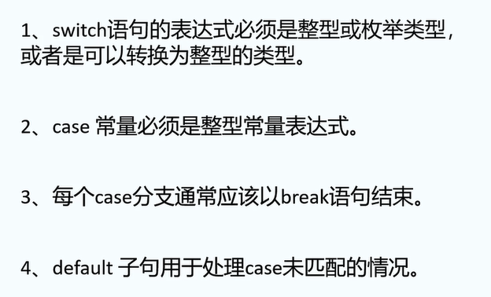
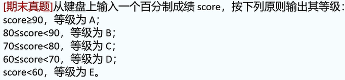

1.编写一个程序,实现符号函数(sgn):

当用户输入正数时输出1,否则什么也不输出.

实例代码段:

```
int x;
scanf("%d",&x);
if(x>0){
	printf("1");
} // 注意: 不用加分号
```


2.三种结构化程序: 顺序，选择，循环。

顺序: 程序依次读取代码并一行一行执行.

选择: 有些代码可能不执行.(if,else,switch,case)

循环: 有些代码可能执行很多次.(while,do-while,for)


3.if语句的基本形式:

```
if(条件判断){
	执行语句;
}

// 也可以这样写
if(条件判断)
{
	执行语句;
}
```

实例:

```
if(x>0){
	printf("x不是一个负数\n");
	printf("x是一个正数");
}
```

注1: 如果if内只嵌套一个语句,可以不写花括号.

```
// 正确的
if(x>0)
	printf("x是正数");

// 如果是两个语句:
if(x>0)
	printf("x是正数");
	x--; // x--会被默认执行
```

3.else: 如果if语句内的内容不成立,则默认执行else中的代码.

if+else:

```
if(x>0){
	printf("x是一个正数");
}
else{
	printf("x不是正数");
}
```


4.if+else if:

```
if(x>0){
	printf("x是一个正数");
}
// 注意: 是两个等号而非一个等号
else if(x==0){
	printf("x=0");
}
else if(x>-1){
	printf("-1<x<0");
}
```


5.题目1.判断语法正确与否.

注意: 分号与语句结尾


答案: B

注意语句结尾的分号(何时该加,何时不该加).

6.题目2.


min=-34.

7.题目2.


提示: 使用if+else if完成此题目.

答案:

```
#include <stdio.h>
int main(void){
	unsigned hour = 0;
	scanf("%d",&hour);
	float payment = 0;
	if(hour<=10){
		payment = 30;
	}
	else if(hour<=50){
		payment = hour * 3;
	}
	else{
		payment = hour * 2.5;
	}
	printf("总的上网费用为%f",payment);
}
```

8.switch分支结构:

基本形式:

```
switch(待判断变量){
	case 常量1:
		...
		break;
	case 常量2:
		...
		break;
	...
	default:
		...
		break;
	
}
```

9.switch语句注意点



10.例题.使用switch-case实现题目要求.(我先写一遍)



提示: 使用/法:

如果x为整数且90<=x<100,则必有:

x/10=9(C语言特殊语法)

答案:

```
int score;
char level;
scanf("%d",&score);
switch(score/10){
	case 10:
	case 9:
		level = 'A';
		break;
	case 8:
		
}
```


10.


