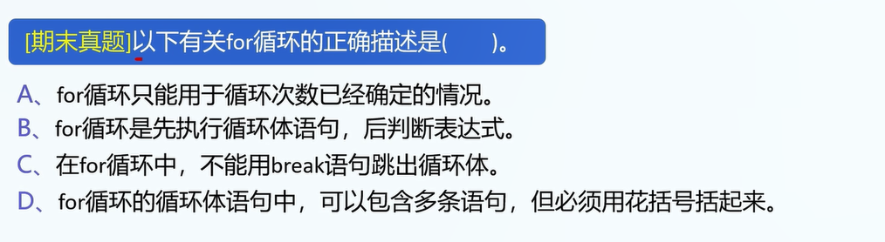
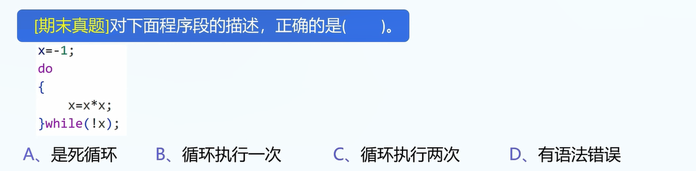

1.什么是循环? 一直做就是循环.

2.三种基本循环结构:

while,do-while,for循环

3.要求: 输出10个1

使用循环写,会比较便捷.

可行但很繁的写法:

```c
printf("1");
printf("1");
printf("1");
printf("1");
printf("1");
printf("1");
printf("1");
printf("1");
printf("1");
printf("1");
```


4.while循环

```
// 语法:
while(expression){
	// do sth.
}

int x = 1;
while(x<=10){
	printf("1\n");
	x++;
}
```


注1: 判断while循环执行的总次数:

```
1.看控制变量的开始值: 1
2.看控制变量的在执行最后一次循环时候的值: 10
3.看每次循环如何改变控制变量: 值++
4.计算: 1-10,每次加1: 执行10次
```


3.do-while循环

```
do{
	// do sth.
}while(条件);
```

注1: 与while循环的不同: do中的内容会被默认执行一次.

4.for循环

```
// 语法:
for(declaration;judgment;do sth.){
	// do sth.
}

// 实例(循环执行10次):
for(int i=0;i<10;i++){

}

// 等价于:
int i=0;
while(i<10){
	// do sth.
	i++;
}

// 好用的for循环:
for(int i=0;i<n;i++){
	// 遍历: 0-(n-1)的i
}
```

5.break和continue的作用:

break: 立即退出当前循环.

continue: 无视本次循环的剩余语句,立即进入下一次循环.

6.实例: break和continue

```
for(int i=0;i<10;i++){
	if(i==3)
		break;
	printf("The value of i is %d\n",i);
}
// break的效果:
立刻执行该循环}后面的语句,无视当前循环的所有语句.
// 输出: 0,1,2


for(int i=0;i<10;i++){
	if(i==3)
		continue;
	printf("The value of i is %d\n",i);
}

// 输出: 0,1,2,4,5,6,7,8,9
```

注1: break的作用仅为跳出当前循环,如果有多个循环,只会退出当前循环.

实例:

```
for(var i=0;i<1;i++){
	for(var j=0;j<10;j++){
		break; // 只是跳出当前循环
	}
	console.log("i=",i);
}

// 输出: i=1, 而不是什么也不输出.
```


注2: 事实上,break的作用不是跳出当前的`{}`括起来的代码段.(如果讲过switch的话,结合switch-case语句讲解).不要把break的作用和跳出当前的`{}`括起来的代码段相混淆.

真的是跳出当前循环.


7.真题1



答案: D

8.真题2



B

9.程序套路

```
// 1.申请变量
// 2.处理用户输入
// 3.内部逻辑处理
// 4.输出答案
```


10.真题3

求解: sum=1+2+3...+n,用户会从键盘输入n.

```
// 申请变量
int n=0;
int sum=0;

// 读取用户输入
scanf("%d",&n);

// 内部处理逻辑
for(int i=0;i<n;i++){
	sum+=(i+1);
}

// 输出sum
printf("sum=%d\n",sum);
```

10.真题4


```
// 申请变量
int sum=0;
// 处理用户输入
// 不用处理
// 内部处理逻辑
for(int i=1;i<=100;i++){
	if(i%3==0){
		sum+=i;
	}	
}
// 输出答案
printf("sum=%d\n",sum);
```

11.题目5(如果题目4做出来了就不用做)

```
找出所有100-999内的数,它们满足:
百位数的三次方+十位数的三次方+个位数的三次方=它自己.
例:
153: 1的三次方+5的三次方+3的三次方=1+125+27=153=他自己.
154则不满足要求.
```

答案:

```
for(var i=100;i<=999;i++){
    var ge=i%10;
    var shi = ((i-ge)/10)%10;
    var bai = (i-shi*10-ge)/100;
    // console.log("ge:"+ge+" shi:"+shi+" bai:"+bai);
    if(i == ge*ge*ge+shi*shi*shi+bai*bai*bai){
        console.log(i);
    }
}
```


11.真题5(暂时不做,等学完数组和函数之后再做)


