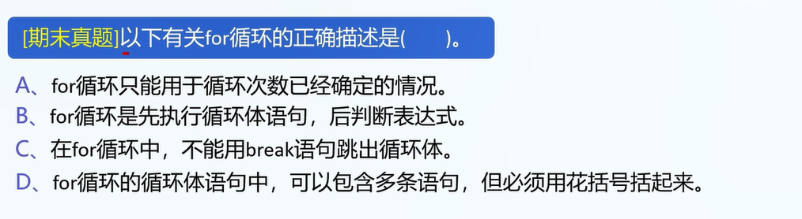
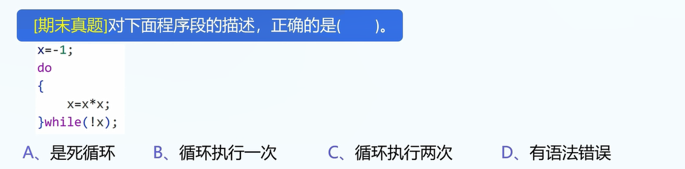

1.三种基本循环结构:

while,do-while,for循环

2.while循环

```
while(expresion){
	// do sth.
}
```

3.do-while循环

```
do{

}while(条件);
```

4.for循环

```
for(declaration;judgment;do sth.){
	// do sth.
}

// example:
for(int i=0;i<10;i++){

}

// 等价于:
int i=0;
while(i<10){
	// do sth.
	i++;
}

// 好用的for循环:
for(int i=0;i<n;i++){
	// 遍历: 0-(n-1)的下标
}
```

5.break和continue:

break: 立即退出循环

事实上,break的作用是跳出当前的{}.(结合switch-case语句)

continue: 无视本次循环的剩余语句,立即进入下一次循环.

6.实例: break和continue

```
for(int i=0;i<10;i++){
	if(i==3)
		break;
	printf("The value of i is %d\n",i);
}
// 输出: 0,1,2


for(int i=0;i<10;i++){
	if(i==3)
		continue;
	printf("The value of i is %d\n",i);
}

// 输出: 0,1,2,4,5,6,7,8,9
```

7.真题1



D

8.真题2



B

9.程序套路

```
// 1.申请变量
// 2.处理用户输入
// 3.内部逻辑处理
// 4.输出答案
```


9.真题3

求解: sum=1+2+3...+n,用户会从键盘输入n.

```
// 申请变量
int n=0;
int sum=0;

// 读取用户输入
scanf("%d",&n);

// 内部处理逻辑
for(int i=0;i<n;i++){
	sum+=(i+1);
}

// 输出sum
printf("sum=%d\n",sum);
```

10.真题4


```
// 申请变量
int sum=0;
// 处理用户输入
// 不用处理
// 内部处理逻辑
for(int i=1;i<=100;i++){
	if(i%3==0){
		sum+=i;
	}	
}
// 输出答案
printf("sum=%d\n",sum);
```

11.真题5(暂时不做,等学完数组和函数之后再做)


12.程序四步走:
```
// 程序四步走:
// 申请变量
// 处理用户输入
// 程序内部处理
// 输出答案
```

