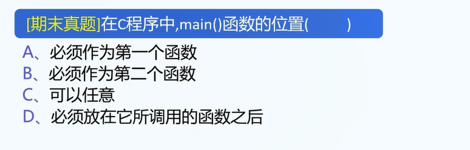

1.函数实例:

实例1:使用返回值的函数

```
int test(){
	return 1;
}

// 函数的执行顺序:
先调用函数
再返回函数的返回值
最后令值=x
int x = test(); // x=1

// 可以看到,test()的写法和printf("...")函数很类似.
```

教学: 记得当面手写一遍代码.


实例2: 有参数的函数

参数: 输入函数的值称为参数.

```
int test(int x){
	return x*2;
}

int x = test(1); // x=2
```


实例3: 多个参数的函数.

```
int test(int x,int y){
	return x*2+y;
}

int x = test(1,2);
```


2.函数语法:

A.函数的定义与调用: 要先定义,后调用函数.

函数的定义:

```
[返回类型] [函数名](参数列表){
	// do sth.
	return ...; // 返回值必须与返回类型相匹配
}
```

参数列表的格式:

A1.可以没有参数.

A2.格式:

```
参数类型 参数a,参数类型 参数b,参数类型 参数c...
```

实例:

```
int x,int y,int z...
```

A3.可以没有返回值,此时返回类型写void.

void: 空类型.


函数的调用:

```
[函数名](实参1,实参2,...);
返回值: return 后面的东西.
参数列表: 实例化即可.
```

调用实例:

```
int x = test();
```


A4. 函数遇到return语句时,会直接return,不再执行return下面的语句.

```
int test(){
	return 1;
	return 2;
    printf("函数不应该执行到这里\n");
	// 事实上返回1,因为return 1直接结束了函数的执行
	// 也不会打印printf中的内容
}
```


函数的调用实例2:

```
int isPrime(int n){
	// 假设实现了判断n是否为素数的代码
	// 假设: 如果n为素数,返回1
	// 如果n非素数,返回0
}

int main(){
	int n=10;
	if( isPrime(n) ){
		printf("n是素数\n");
	}
	else{
		printf("n不是素数\n");
	}
}
```


4.另一种函数的使用方法: 先声明再调用,后实现

声明+调用+实现的实例:

```
int sum(int x,int y);	// 函数声明

int main(void){
	int x=1,y=2;
	int z = sum(x,y);
	printf("z=%d",z);
}

// 实现:
int sum(int x,int y){
	return x+y;
}
```


声明函数语法:

```
[返回值] [函数名](参数列表);
```


注1: 在C语言中,函数必须先声明后调用,无法先调用后声明.

另一实例:

```
bool isPrime(int n); // 函数声明

int main(void){
	...
	isPrime(n);
	...
}

// 函数实现
bool isPrime(int n){
	...
}
```

5.传值调用与传址调用: 等到到了指针再讲.


6.数组与函数:等到了数组再讲.


7.函数是构成C语言程序的基本单位.


7.真题2.




8.等讲完数组再讲.


9.函数命名方法: 驼峰命名法(推荐使用该命名方法)

大驼峰命名法: 所有单词的首字母大写.

小驼峰命名法: 大驼峰+例外: 首个单词的首字母小写.

注1: 函数、变量名一般使用小驼峰命名法.

注2: 类名一般使用大驼峰命名法.(学到类就懂了)


10.(这题比较难,推荐不要做)


```
#include <stdbool.h>
bool isPrime(int n){
	// do sth.
	if(n==1) return False;
	for(int i=2;i<n;i++){
		if(n%i==0)
			return False;
	}
	return True;
}

```


11.题外话:函数是否能改变传入的值?

对于我们目前学过的数据类型(数值、布尔),如果传入的值是该类型,都是不能改变值的.

规则: 不要以为函数能改变传入函数的变量!

但是对于不同的数据类型,需要分类讨论.这是一件很复杂的事情.

答案: 函数目前不能改变传入的值.

测试代码:

```
void tryToChangeXButFailed(x){
    x=2;
}

int x = 1;
tryToChangeXButFailed(x);
printf(x); // 事实上还是输出1
```

注: 原理之后会解释,不过目前请不要尝试在c的函数中改变变量的值.


18.讲一下指针与函数&rarr;传值调用与传址调用.(有时间就讲)