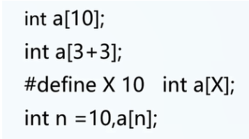
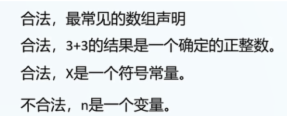
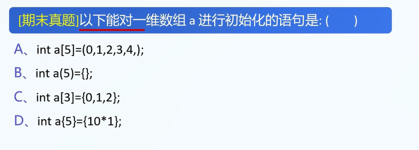
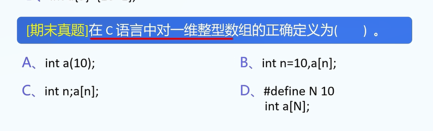
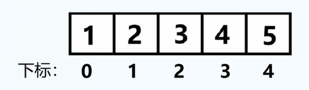
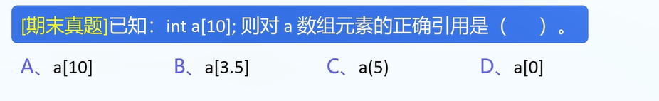
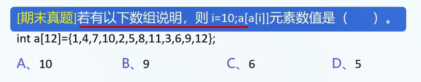
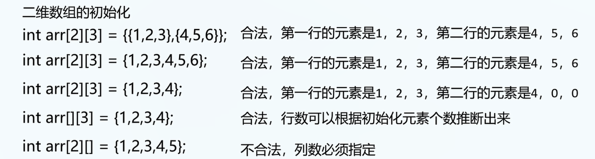
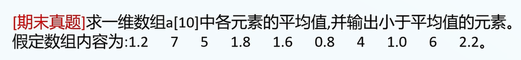
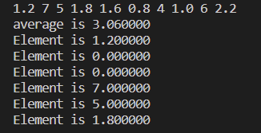

注: 记得让学生看完代码之后直接手打一遍代码.

所谓数据结构: 安排数据的一种结构.

1.引入数组的原因: 分类管理,将同样目标的数据统一存放.

例1.数组的好处.

请撰写程序,目标:

用户输入: 10个数值型变量

输出: 10个变量的和

c代码:

```
int main(void){
	int x1=0,x2=0,x3=0,x4=0,x5=0,x6=0,x7=0,x8=0,x9=0,x10=0;
	scanf("%d",&x1);
	scanf("%d",&x2);
	scanf("%d",&x3);
	scanf("%d",&x4);
	scanf("%d",&x5);
	scanf("%d",&x6);
	scanf("%d",&x7);
	scanf("%d",&x8);
	scanf("%d",&x9);
	scanf("%d",&x10);
    int sum=x1+x2+x3+x4+x5+x6+x7+x8+x9+x10;
    printf("sum is",sum);
}
```

2.使用数组: 大幅简化程序撰写复杂度

```c
int main(void){
	int x[10];
	int sum=0;
	for(int i=0;i<10;i++){
		scanf("%d",&x[i]);
	}
	for(int i=0;i<10;i++){
		sum+=x[i];
	}
	printf("sum is %d\n",sum);
}
```

3.每种数据结构的学习方式: 创建,初始化,读取,修改.

四大天王: **创初读修**.

创建数据结构的别名: 声明.

初始化的别名: 赋值.

读取的别名: 查询.

记忆方式:

**“创初读修”**：

故事记忆法: 创业初期认真读书的人,迷信书本,修改了不少前人的做法,最后遗憾跳楼.

4.数组的创建与初始化

创建:

```
格式:
// 数组类型 数组名[数组大小];
实例:
int a[5];
// 此时x中的值都是垃圾值(没有初始化的数组内部值是垃圾值)
```

注1: 与js语言不同,C语言数组大小必须为正整数,且数组大小在声明时已然确定.

5.判断如下数组声明是否合法.

实例:



答案:



6.数组初始化实例(注意初始化语句必须和创建语句一起写):

A.全部初始化:

```
int a[5]={1,2,3,4,5}; // 直接初始化
int a[]={1,2,3,4,5}; // 合法,数组长度默认为5
int a[5]={1,2}; // 等价声明: a[5]={1,2,0,0,0};
int a[5]={0}; // 同上,全零初始化
```

B.没有初始化: 数组没有默认值,和没有初始化的x一样,都是垃圾值.


7.真题



答案:C


8.真题



答案:D


9.数组的特性

A.数组: 存储**相同类型**的数据.

B.数组的元素是连续存放的.

C.数组通过下标来访问元素,下标从0开始.


10.实例:

```
int arr[5]={1,2,3,4,5};
```

对应的下标:




学习数组的创建与访问:


11.数组元素的访问(access)

```
[array_name][下标]即可访问.
```

下标: 非负整数.

下标越界: 导致undefined behavior(未定义行为).

```
int a[n]; // 合法下标: 0-(n-1)
```




12.真题



答案: C

13.一维数组总结:

A.一维数组的创建：声明与初始化

B.一维数组元素的访问（读取与修改)

学习数据类型: 声明、初始化、读取、修改.


14.二维数组(类似矩阵): 

数组: **存储相同类型**的数据.

二维数组: **存储一维数组**的数组.

声明: 

```
基本数据类型 数组名[行数][列数];
// 声明的实例:
int a[2][3]; // 声明两行三列的数组
```

注: 接在数组屁股后面的括号可以留空,其余数字必须存在.

初始化:



16.真题



```
// 输入:
1.2 7 5 1.8 1.6 0.8 4 1.0 6 2.2
int main(void){
	float sum = 0;
	float average = 0;
	float a[10]={0};
	for(int i=0;i<10;i++){
		scanf("%f",&a[i]);
	}
	for(int i=0;i<10;i++){
		sum+=a[i];
	}
	average = sum / 10;
	float lessThanAverage[10]={0};
	int index = 0 ;
	for(int i=0;i<10;i++){
		if(a[i]<average){
			lessThanAverage[i]=a[index];
			index++;
		}	
	}
	// index为实际有效的index+1
	// 输出平均值
	printf("average is %f\n",average);
	// 输出小于平均值的元素
    for(int i=0;i<index;i++){
    	printf("Element is %f\n",lessThanAverage[i]);
    }
}


```

显示:



17.